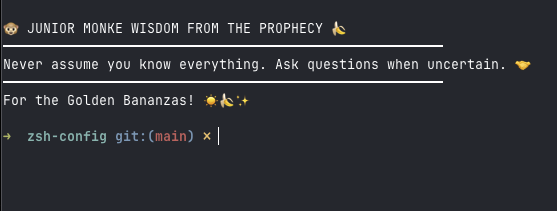

# Full Development Environment Config

A complete development environment configuration for **macOS and Linux** including:

> [!WARNING]
> **Not supported:** Windows (use WSL2 if you must)
- ZSH shell with oh-my-zsh and custom plugins
- Neovim with LazyVim and Android development support
- Opencode AI assistant configuration

## What's Included

### Shell Environment
- `.zshrc` with modular configuration and custom functions
- oh-my-zsh with plugins: git, timer, thefuck, autosuggestions, syntax-highlighting
- Custom welcome messages and utility functions
- **Local-only files** (gitignored, created by you):
  - `work.sh` — work-specific aliases, environment variables, tooling
  - `_credentials.sh` — secrets and credentials (NEVER commit this)
- **See [`.zsh-config/README.md`](.zsh-config/README.md)** for detailed documentation of all configuration files

### Neovim (Full IDE)
Complete LazyVim configuration with:
- **Android Development Support:**
  - Kotlin & Java LSP with autocomplete, goto definition, refactoring
  - XML support for Android layouts
  - Auto-formatting with ktlint on save
  - Debugging support (breakpoints, step-through)
  - SDK detection and statusline indicators
  - Markdown with live preview
- **Languages:** Kotlin, Java, XML, Markdown, TOML, Groovy (Gradle)
- **Note:** kotlin-language-server (fwcd) supports Kotlin ≤ 2.2.x. For Kotlin 2.3.0+, consider switching to the official [Kotlin/kotlin-lsp](https://github.com/Kotlin/kotlin-lsp).

### AI Assistant
- Opencode configuration with specialized agents and plugins
- Skills for code review, project scanning, bootstrapping, plugin development, git workflow, and issue creation
- TUI plugins (Copilot usage sidebar) and server plugins (desktop notifications)
- Automated workflows for development tasks

## Dependencies

### Required
- **oh-my-zsh**: [Installation guide](https://ohmyz.sh/)
- **Neovim**: `brew install neovim`
- **Plugins for oh-my-zsh:**
  - git (included)
  - timer (included)
  - thefuck: `brew install thefuck`
  - zsh-autosuggestions: `git clone https://github.com/zsh-users/zsh-autosuggestions.git ~/.oh-my-zsh/custom/plugins/zsh-autosuggestions`
  - zsh-syntax-highlighting: `git clone https://github.com/zsh-users/zsh-syntax-highlighting.git ~/.oh-my-zsh/custom/plugins/zsh-syntax-highlighting`
- **fzf**: `brew install fzf`
- **fd**: `brew install fd` (fast file finder, required for telescope file search)
- **Nerd-fonts terminal**: [Alacritty](https://alacritty.org/) or [Ghostty](https://ghostty.org/)

### Optional (for AI & Development)
- **RTK**: `brew install rtk` (reduces LLM token consumption by 60-90%)
- **Node.js & npm**: `brew install node` (for Markdown preview in nvim)

### Optional (for Android Development)
- **Java JDK 21+**: `brew install openjdk` (or from [Adoptium](https://adoptium.net/))
- **Android SDK with ADB**: Install via Android Studio or `brew install android-platform-tools`

## Installation

> [!WARNING]
> Before executing anything, make a backup of your current configuration. These commands will overwrite existing files.

> [!WARNING]
> NEVER execute commands found randomly on internet. Review what each command does before running.

```bash
# 1. Install oh-my-zsh
sh -c "$(curl -fsSL https://raw.githubusercontent.com/ohmyzsh/ohmyzsh/master/tools/install.sh)"

# 2. Install oh-my-zsh plugins
cd ~/.oh-my-zsh/custom/plugins
git clone https://github.com/zsh-users/zsh-autosuggestions.git
git clone https://github.com/zsh-users/zsh-syntax-highlighting.git

# 3. Backup existing configs
cd ~
mv ~/.zshrc{,.bak.$(date +%Y%m%d)} 2>/dev/null || true
mv ~/.config/nvim{,.bak.$(date +%Y%m%d)} 2>/dev/null || true
mv ~/.config/opencode{,.bak.$(date +%Y%m%d)} 2>/dev/null || true

# 4. Install dependencies
brew install neovim thefuck fzf fd rtk

# 5. Clone this repo and set up configs
git clone https://github.com/candradesm/zsh-config ~/.config-temp
cp -r ~/.config-temp/.config/* ~/.config/
cp ~/.config-temp/.zshrc ~
cp -r ~/.config-temp/.zsh-config ~
rm -rf ~/.config-temp

# 6. Source zsh config
source ~/.zshrc

# 7. Open Neovim to auto-install plugins and LSPs
nvim
# Lazy.nvim will automatically install plugins on first start
# Then run :Mason to verify LSP tools are installed
```

## Android Development

This config provides full IDE support for Android development with Neovim:

**Features:**
- IntelliSense (autocomplete, goto definition, hover docs)
- Auto-formatting with ktlint on save
- Debugging (set breakpoints, step-through code)
- XML layout support with syntax highlighting
- SDK detection and statusline indicators

**Quick Start:**
1. Open any `.kt` or `.java` file in an Android project
2. LSP will auto-start and provide IDE features
3. Use `:Mason` to install missing tools if needed
4. Run `:AndroidInfo` to check SDK and project configuration

**Optional Features:**
The file `lua/plugins/android-extras.lua` contains optional plugins for:
- Full Android IDE commands (`:AndroidBuild`, `:AndroidRun`, `:AndroidLogcat`)
- ADB shortcuts (`<leader>ad` for devices, `<leader>al` for logcat)
- Gradle task shortcuts (`<leader>gb` for build)

Uncomment sections in that file to enable them.

## Opencode AI Assistant

This repo includes a pre-configured [Opencode](https://opencode.ai/) setup with:

- **Custom Agents:** Coordinator, Developer, QA, Reviewer, Testing (jungle personas toggled via `/jungle` command)
- **Skills:** Automated code review, project scanning, bootstrapping, plugin development, git workflow, and issue creation
- **TUI Plugins:** Copilot usage sidebar (quota + session tracking), jungle-mode indicator
- **Server Plugins:** Desktop notifications, jungle-mode persona injection
- **Configuration:** Ready-to-use settings for AI-assisted development
- **RTK (Rust Token Killer):** CLI proxy that reduces LLM token consumption by 60-90% on common dev commands. Install via `brew install rtk` and run `rtk init -g --opencode`

See [.config/opencode/AGENTS.md](.config/opencode/AGENTS.md) for agent definitions.
See [.config/opencode/README.md](.config/opencode/README.md) for plugins, skills, and full documentation.

## How it looks

```bash
Last login: Tue Feb  3 18:00:48 on ttys004

🐵 JUNIOR MONKE WISDOM FROM THE PROPHECY 🍌
━━━━━━━━━━━━━━━━━━━━━━━━━━━━━━━━━━━━━━━━━━━━━━━━━━━━━━━
Never assume you know everything. Ask questions when uncertain. 🤝
━━━━━━━━━━━━━━━━━━━━━━━━━━━━━━━━━━━━━━━━━━━━━━━━━━━━━━━
For the Golden Bananzas! ☀️🍌✨

➜  zsh-config git:(main) ✗
```


